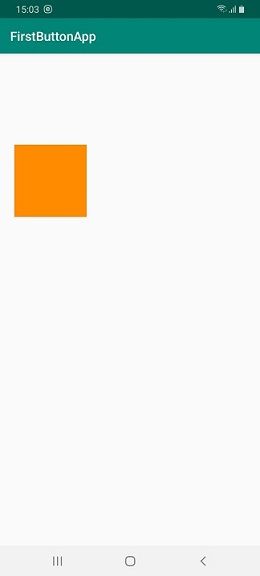
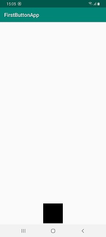
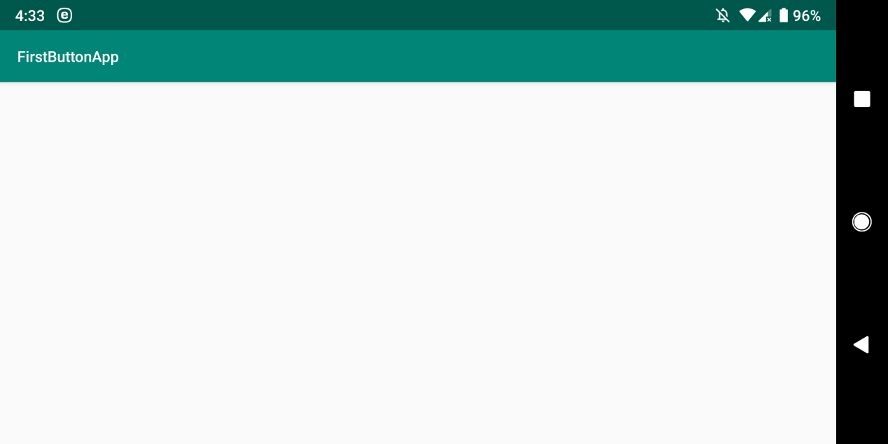
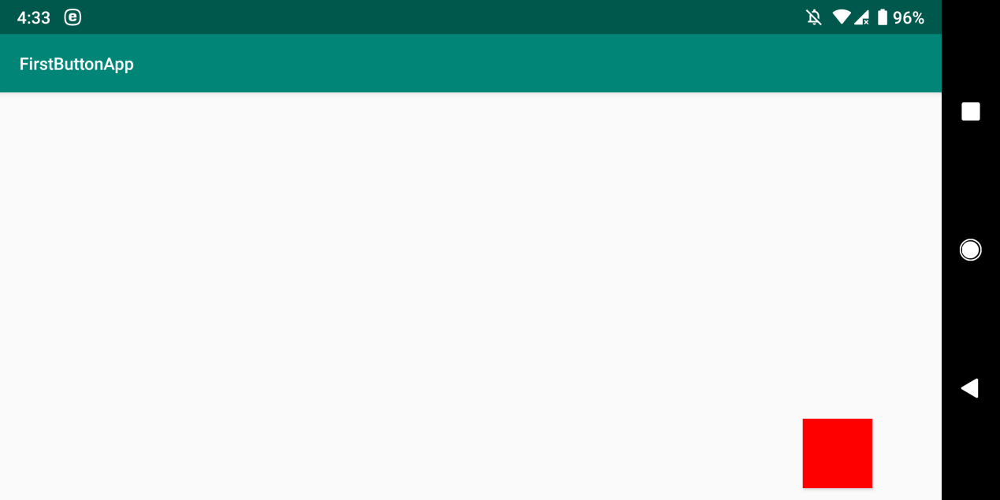

**GT-Helper**

**First Android app - interacts with Google Translate**

This application guides the user how to use Google Translate's camera, to
translate text from Hebrew to Polish, in order to read aloud the Polish text.

This process was done, because reading aloud Hebrew text is not supported in GT.

The application was tested on Samsung Galaxy A70 device (resolution of
1080\*2400).

**First screen:** The user is directed, vocally, to press the orange button
twice;

this results in launching Google Translate app and showing GT's camera.

**Second screen:**

The user has to press the black button twice;

This results in going back to GT's camera and pressing "Scan" button.

This reflects the recent changes done in Google Translate, summer 2019.

**Third screen:** after taking the photo with GT's camera and going to
translation,

we now have a blank screen. On this screen, the user has to swipe up using
finger.

**Fourth screen:** The user has to press the red button. This will lead to the
last step, which is copying the translated text from GT, to the clipboard.

Now, the user will hear the translated text read aloud, in Polish.

**Code:**

**MainActivity.java:** The first screen.

<https://github.com/LiorBob/GT-Helper/blob/master/app/src/main/java/com/example/user/firstbuttonapp/MainActivity.java>

**SecondActivity.java:** The second screen.

<https://github.com/LiorBob/GT-Helper/blob/master/app/src/main/java/com/example/user/firstbuttonapp/SecondActivity.java>

**ThirdActivity.java:** The third screen.

<https://github.com/LiorBob/GT-Helper/blob/master/app/src/main/java/com/example/user/firstbuttonapp/ThirdActivity.java>

**FourthActivity.java:** The fourth screen.

<https://github.com/LiorBob/GT-Helper/blob/master/app/src/main/java/com/example/user/firstbuttonapp/FourthActivity.java>

**OnSwipeTouchListener.java:** A class for the swipe up gesture. Found on the
net, used by ThirdActivity.java above.

<https://github.com/LiorBob/GT-Helper/blob/master/app/src/main/java/com/example/user/firstbuttonapp/OnSwipeTouchListener.java>

**YouTube demo:**

<http://www.youtube.com/watch?v=yW6o3kT9zvk>
